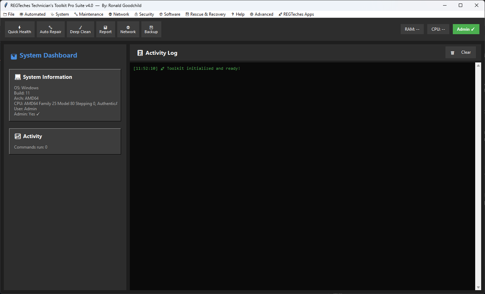

# Technician's Toolkit

A free, all-in-one **Windows IT technician toolkit** in a single dark-mode Python/Tkinter app: health checks, repairs, cleanup, network tools, security tools, software management and rescue/recovery - hundreds of common commands behind one GUI, with a live log of what ran.

> "Pro Suite" v4.0 - built by a working technician who got tired of retyping the same commands on every service call. Free to use, free to change.

## Screenshots


*System dashboard with the Automated / Maintenance / Network / Security menus*

## What is inside

| Area | Examples |
|------|----------|
| **Automated tools** | Quick PC health check, auto-repair (SFC + DISM), aggressive/deep cleanup |
| **Diagnostics** | Hardware info (CPU, RAM, disk, GPU), SMART and memory checks, battery report, system report |
| **Maintenance** | Disk cleanup and optimisation, temp/cache clearing, **complete Windows Update repair**, Defender repair, event logs, disk error checks |
| **Network** | Diagnostics, network stack reset, IP renew, DNS flush, Wi-Fi profiles |
| **Security** | Defender scans, user accounts, security policy, certificates, hotfix list |
| **Software** | Installed programs, winget integration (search / install / update) |
| **Rescue & recovery** | Driver backup, browser data backup, registry backup/restore, restore points, Wi-Fi profile backup |
| **AI helpers** | One-click links to ChatGPT, Claude and Gemini with troubleshooting tips |

Open [docs/reference.html](docs/reference.html) in a browser for the full command reference.

## Requirements

- Windows 10 / 11
- Python 3.9+ - **standard library only, no `pip install`**
- Run as **Administrator** for most repair and maintenance tools

## Quick start

```powershell
git clone https://github.com/ronaldgoodchild/technicians-toolkit.git
cd technicians-toolkit
python technicians_toolkit.py
```

Single `.exe`: `pip install pyinstaller` then `pyinstaller --onefile --windowed --name TechniciansToolkit technicians_toolkit.py`.

## Companion apps (optional)

The toolkit can launch these sibling projects if their files sit next to `technicians_toolkit.py`:

- [AppForge](https://github.com/ronaldgoodchild/appforge) - winget / Chocolatey GUI (`appforge.py`)
- [BackupPro](https://github.com/ronaldgoodchild/backuppro) - backup suite (`backuppro.py`)
- [CyberScan](https://github.com/ronaldgoodchild/cyberscan) - security audit dashboard (`cyberscan.ps1`)

## Safety

Many tools change system settings, delete caches or reset network/Windows Update components. Read the prompts, create a restore point first, and use it only on machines you own or are authorised to service. No warranty - see [LICENSE](LICENSE).

## Contributing

Ideas and pull requests welcome - see [CONTRIBUTING.md](CONTRIBUTING.md) and [ROADMAP.md](ROADMAP.md).

## License

[MIT](LICENSE) (c) 2026 Ronald Goodchild / REGTeches
